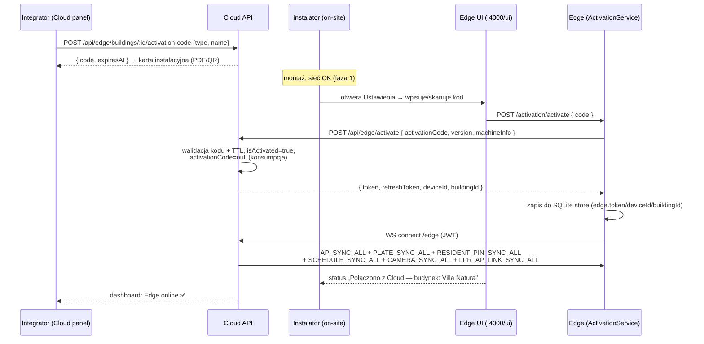
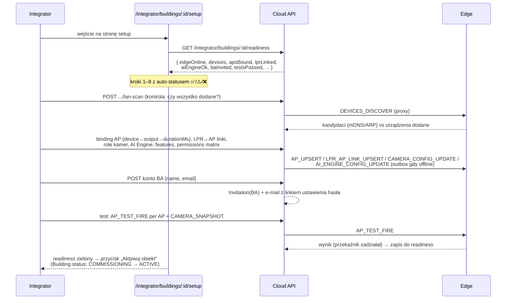
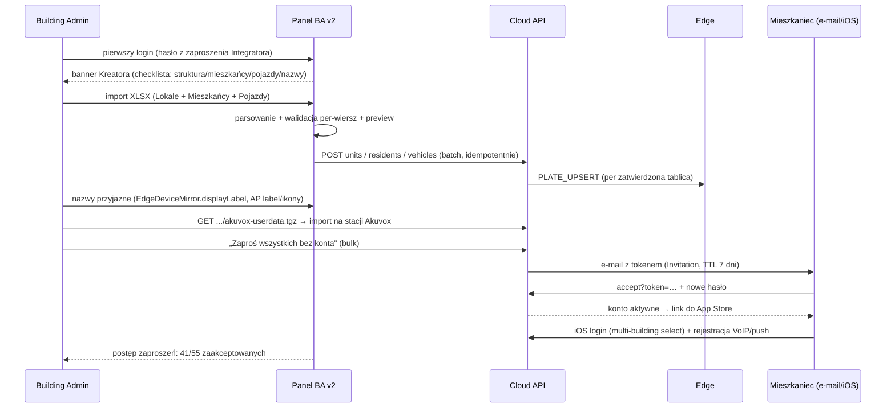

# Onboarding nowego obiektu — instalacja, konfiguracja, mieszkańcy (design doc)

> Status: **PROJEKT — do akceptacji właściciela** (2026-07-02). Zero zmian w kodzie.
> Dokument definiuje całościowy proces uruchomienia GateLynk w nowym
> budynku/osiedlu: od montażu sprzętu po obiekt „gotowy do zamieszkania"
> (stan docelowy = to, co tworzy `apps/api/prisma/seed-villa-natura.ts`).
> Każda faza ma gap-analysis: co JUŻ ISTNIEJE w kodzie vs co TRZEBA ZBUDOWAĆ,
> więc sekcja 7 (roadmapa) jest bezpośrednio zlecalna jako kolejne PR-y.

## Spis treści

1. [Cel i punkt wyjścia](#1-cel-i-punkt-wyjścia)
2. [Aktorzy i odpowiedzialności](#2-aktorzy-i-odpowiedzialności)
3. [Audyt stanu obecnego](#3-audyt-stanu-obecnego)
4. [Rekomendowany przepływ end-to-end (fazy 0–7)](#4-rekomendowany-przepływ-end-to-end)
5. [Kluczowe decyzje projektowe](#5-kluczowe-decyzje-projektowe)
6. [Diagramy sekwencji (fazy 2, 4, 5)](#6-diagramy-sekwencji)
7. [Roadmapa implementacji](#7-roadmapa-implementacji)
8. [Otwarte pytania do właściciela](#8-otwarte-pytania-do-właściciela)

---

## 1. Cel i punkt wyjścia

### Propozycja właściciela (baseline)

1. **Instalator** montuje GateLynk Edge w sieci budynku i dodaje urządzenia.
2. **Integrator** ma wizard, w którym *przypisuje inwestycję do GateLynk Edge*
   i włącza poszczególne usługi.
3. **Administrator budynku (BA)** dostaje Kreator: edycja nazw domofonów,
   dodawanie mieszkańców, mieszkań, samochodów itd.

### Ocena i główna korekta

Szkielet 3 ról jest dobry i zostaje. **Jedna istotna zmiana kolejności**:
w pkt 2 właściciel zakłada „Edge najpierw, przypisanie inwestycji później".
Istniejący kod działa **odwrotnie i lepiej**: kod aktywacyjny jest generowany
**per budynek** (`EdgeDevice.buildingId` + `activationCode`,
`apps/api/prisma/schema.prisma:291-318`), a Edge w momencie aktywacji
*dostaje* `buildingId` z odpowiedzi Cloud
(`apps/edge/src/activation/activation.service.ts` → `POST /api/edge/activate`).
Czyli: **inwestycja powstaje w Cloud PRZED montażem**, a „przypisanie Edge do
inwestycji" to nie osobny krok wizarda, tylko efekt uboczny wpisania kodu.
Przebudowa na „pulę nieprzypisanych Edge'ów" nie daje żadnej wartości przy
skali 1–10 obiektów, a psuje działający, przetestowany flow. Uzasadnienie
szczegółowe: decyzja D1 (sekcja 5).

Druga korekta: wizard Integratora **nie włącza tunelu ani nie dodaje urządzeń**
(to robi Instalator w Edge UI, zgodnie z decyzją architektoniczną 2026-06-02,
`CLAUDE.md:903-942`) — wizard Integratora jest **orkiestratorem i checklistą**
nad istniejącymi kartami (binding AP, LPR-linki, role kamer, AI Engine,
object type, permissions matrix), których dziś trzeba szukać po 3 stronach.

---

## 2. Aktorzy i odpowiedzialności

Zgodnie z decyzją architektoniczną „podział Edge UI vs Cloud Integrator"
(2026-06-02, `CLAUDE.md:903-942`): **warstwa fizyczna on-site w Edge UI,
warstwa logiczno-biznesowa off-site w Cloud**.

| Aktor | Gdzie pracuje | Odpowiada za | Czego NIE robi |
|---|---|---|---|
| **Instalator** (ekipa montażowa; często pracownik integratora) | **Edge UI** `http://<edge>:4000/ui` (LAN, on-site) | Montaż + sieć; aktywacja Edge kodem; dodanie urządzeń (IP/hasła/model — `WizardPage.tsx` 5 kroków); konfiguracja przekaźników (hold-time, polarity); testy fizyczne („Wyzwól", snapshot, ISAPI check); backup configu | Nie tworzy inwestycji, nie nazywa punktów dostępu „po ludzku", nie dotyka mieszkańców. **Brak konta w Cloud** — autoryzacja przez fizyczny dostęp do LAN + PIN Edge UI (do zbudowania, PR-2) |
| **Integrator** (firma prowadząca obiekt technicznie) | **Cloud panel** `apps/web/src/app/(integrator-dashboard)` | Utworzenie inwestycji + typ obiektu; wygenerowanie kodu aktywacyjnego; wizard konfiguracji (AP binding, LPR↔AP, role kamer, AI Engine, harmonogramy); permissions matrix (co BA/Concierge/Resident widzi); utworzenie konta BA; health-check „obiekt gotowy"; monitoring multi-budynkowy | Nie wpisuje haseł urządzeń (to na Edge, on-site); nie zarządza mieszkańcami |
| **Administrator budynku (BA)** | **Cloud panel BA v2** `apps/web/src/app/(ba-v2)` | Kreator obiektu: klatki/lokale, import mieszkańców + pojazdów (XLSX), przyjazne nazwy urządzeń i punktów dostępu, eksport listy do domofonu Akuvox, zaproszenia mieszkańców, codzienna operacja | Nie dotyka konfiguracji technicznej (IP, bindingi, permissions matrix) |
| **Mieszkaniec** | **iOS app** `apps/ios` | Akceptacja zaproszenia → ustawienie hasła → login (multi-building select, VoIP token); własne pojazdy (PENDING→approval), goście, PIN | Konto tworzy BA/import — mieszkaniec **nie rejestruje się sam** |
| **Konsjerż** (opcjonalny, `has_concierge` w features) | Cloud `/concierge/*` | Operacja bieżąca — poza zakresem onboardingu (konto tworzone analogicznie do BA) | — |

**Instalator ≠ nowa rola w Cloud.** Rekomendacja: nie tworzymy konta
„Instalator" w bazie (decyzja D3-b). Ślad audytowy instalacji zostaje w Edge
(`event-log`) i w `EdgeDevice.machineInfo`/`activatedAt`.

---

## 3. Audyt stanu obecnego

Co już mamy — z odnośnikami. To jest fundament: **większość klocków istnieje,
brakuje orkiestracji (wizard/kreator/checklisty) i kilku spoin.**

### 3.1 Aktywacja Edge (kompletny, działający flow)

- Model `EdgeDevice` (`apps/api/prisma/schema.prisma:291-318`): `buildingId`,
  `type EDGE|EDGE_AI`, `activationCode @unique` + `activationCodeExpiresAt`,
  `isActivated`, `activatedAt`, `lastSeenAt`, `ipAddress`, `version`,
  `machineInfo Json`.
- Cloud (`apps/api/src/edge/edge.controller.ts` + `edge.service.ts`):
  - `POST /api/edge/buildings/:buildingId/activation-code` (JWT integratora;
    body `{type, name}`) — generuje jednorazowy kod z TTL.
  - `POST /api/edge/activate` (publiczny) — kod → `{token, refreshToken,
    deviceId, buildingId}`; kod jest konsumowany (`activationCode: null`).
  - `POST /api/edge/refresh`, `GET .../devices` (+`isOnline` z
    `EdgeGateway`), `DELETE /api/edge/devices/:id`, `GET .../device-tree`.
- Edge (`apps/edge/src/activation/`): `ActivationService.activate(code)`
  wysyła `machineInfo`, zapisuje token/deviceId/buildingId/cloudUrl w SQLite
  store; lokalny `ActivationController`: `GET /activation/status`,
  `GET/POST /activation/config` (cloudUrl), `POST /activation/activate`,
  `POST /activation/deactivate` — czyli **ekran parowania w Edge UI istnieje**.
- Tunel WS `/edge` (`apps/api/src/edge/edge.gateway.ts` ↔
  `apps/edge/src/tunnel/tunnel.service.ts`) z auth tokenem JWT z aktywacji.

**Luki:** brak rate-limit/bruteforce-guard na publicznym `POST /api/edge/activate`;
UI generowania kodu jest tylko w **legacy** panelu superadmina
(`apps/web/src/app/(dashboard)/buildings/[id]/page.tsx`) — nie ma go w nowym
`(integrator-dashboard)`; kod trzeba przepisywać ręcznie (brak QR).

### 3.2 Edge UI (lokalny panel :4000/ui)

- Nowe SPA React+Vite (`apps/edge/web/src/pages/`): `WizardPage` (5-krokowy
  kreator: typ → driver+**discovery scan** → config z walidacją → **test
  urządzenia** → nazwa), `AccessPage` (przekaźniki/AP), `MonitoringPage`,
  `SystemPage`, `SettingsPage`, `LogsPage`, `LprReadsPage`. Legacy
  `/ui-legacy` (`apps/edge/public/index.html`, `wizard.html`).
- Discovery (`apps/edge/src/discovery/`): mDNS + KNXnet/IP adaptery,
  `oui-lookup.ts`; ARP sweep opisany jako „przyszłość" w `discovery.types.ts:7`.
- Drivery urządzeń: `packages/device-drivers` (katalog driverów, m.in.
  `akuvox-smartplus`, Hikvision LPR), rejestr urządzeń w Edge SQLite
  (`store.db`), mirror do Cloud przez `DEVICE_UPSERT/DEVICE_SYNC_ALL` →
  `EdgeDeviceMirror` (`schema.prisma:354-378`).

**Luki:** **Edge UI nie ma żadnej autoryzacji** (brak guardów na kontrolerach
UI — każdy w LAN może otwierać bramy i kasować urządzenia); brak ARP sweep
(urządzenia bez mDNS są niewidoczne w skanie); brak „trybu instalatora"
z checklistą postępu.

### 3.3 Panel Integratora (Cloud)

- Multi-budynkowy dashboard `/integrator/dashboard` (Faza 8.f), lista
  budynków, `/integrator/edges`, `/integrator/tools`.
- `/integrator/buildings/[id]/devices` — komplet kart konfiguracyjnych:
  `DeviceTreeSection` (drzewo urządzeń z Edge), `IntegratorAccessPointsSection`
  (binding AP→device→output→durationMs), `IntercomsModule`, `LprCamerasModule`
  + `IntegratorLprLinkageCard` (multi-link LPR↔AP z direction IN/OUT),
  `IntegratorCameraSettingsCard` (role STANDARD/LPR + AI toggle),
  `IntegratorAiEngineCard` (URL/model/test).
- Object type + features: `Building.objectType` (5 typów) + `features` JSON
  (`apps/api/src/buildings/buildings.constants.ts`), karta
  `IntegratorObjectTypeCard`.
- **Permissions Matrix** (Faza 8.e): `Building.featurePermissions` JSON,
  19 system features + per-AP, defaults per objectType
  (`apps/api/src/buildings/feature-permissions.constants.ts`).
- Narzędzia gotowe do reuse w wizardzie: `LanScanModal` (proxy skanu LAN przez
  Edge: `POST /integrator/buildings/:id/lan-scan`), `DiagnosticsModal`,
  `ExportConfigModal` (backup configu), `HealthReportModal`
  (`GET /integrator/health-report`), `AuditLogSection`.
- Karta Akuvox: `apps/web/src/components/AkuvoxStationCard.tsx` — eksport
  `UserData.tgz` (lista mieszkańców do importu na stacji) + ściąga konfiguracji.

**Luki:** brak wizarda/kreatora (0 trafień `wizard|kreator` w
`(integrator-dashboard)`); brak widoku „postęp uruchomienia obiektu"; brak
generowania kodu aktywacyjnego; health-report jest globalny, nie per-budynek
jako checklista gotowości.

### 3.4 Panel BA v2

- Taby (`apps/web/src/app/(ba-v2)/building-admin/v2/buildings/[id]/`):
  overview, residents, units, vehicles, payments, security, courier-visits,
  knowledge, lpr-reads, issues, notifications, devices, guests.
- **3-krokowy `AddResidentWizard.tsx`** (`apps/web/src/components/ba-v2/`):
  Dane → Lokal → Dostęp; w kroku „Dostęp" dwie opcje: *hasło startowe* (BA
  ustawia, `POST .../residents/:rId/set-password`,
  `building-admin.service.ts:527`) albo *„mieszkaniec ustawi sam"* — ale ta
  druga ścieżka **nie ma dziś kontynuacji** (brak resetu hasła / accept-flow
  dla mieszkańca).
- Edycja nazw urządzeń: `EdgeDeviceMirror.displayLabel` z ochroną przed
  nadpisaniem przez sync (`labelUpdatedBy`, `schema.prisma:365-371`);
  AP label/icon/kolejność drag-drop (Faza 5, `.../access-points`).
- **Import XLSX istnieje, ale w złym miejscu**: pełny importer Lokale +
  Mieszkańcy (szablon do pobrania, walidacja per-wiersz, preview, progress)
  żyje w legacy panelu superadmina:
  `apps/web/src/app/(dashboard)/buildings/[id]/import/page.tsx`.
- **Moduł zaproszeń mieszkańców istnieje w API, nieużywany przez BA v2**:
  `apps/api/src/invitations/` — model `Invitation`
  (`schema.prisma:911-930`: residentId, unitId, tokenHash, status, expiresAt),
  wysyłka e-mail przez Resend, publiczny `POST /api/invitations/accept?token=`.
  Guard `JwtAuthGuard` (JWT integratora) — BA nie ma do niego dostępu.

### 3.5 Sync Cloud↔Edge (nic do budowania w onboardingu)

- Outbox (Faza 7.6): `EdgeSyncOutboxEntry` + `EdgeOutboxService` — retry,
  deadletter, cleanup; gwarancja dostarczenia przy offline.
- Przy każdym reconnect Edge (`EdgeGateway.pushAccessPointSync`) idzie pełny
  replace-all: `AP_SYNC_ALL`, `CAMERA_SYNC_ALL`, `LPR_AP_LINK_SYNC_ALL`,
  `PLATE_SYNC_ALL`, `RESIDENT_PIN_SYNC_ALL`, `SCHEDULE_SYNC_ALL` (+ na bieżąco
  `PIN_*`, `DEVICE_CONFIG_UPDATE`, `AI_ENGINE_CONFIG_UPDATE`,
  `BUILDING_CONFIG_UPDATE`).
- **Konsekwencja dla onboardingu:** wszystko co Integrator/BA sklika w Cloud
  „dojedzie" na Edge samo — projekt nie wymaga żadnej nowej mechaniki sync.
  Ręczne (nie syncowane, celowo per decyzja 2026-06-02): IP + hasła urządzeń
  LAN — tylko Edge UI on-site.

### 3.6 iOS i seed

- Login: email+hasło → `requiresBuildingSelection` → picker →
  `POST /resident/auth/select-building`; rejestracja VoIP/push tokenu po
  zalogowaniu. Brak samodzielnej rejestracji (by design).
- `seed-villa-natura.ts` (637 linii) = definicja „kompletnego obiektu":
  licencja, admin/integrator, building, BA, concierge, klatka, lokale,
  mieszkańcy (pivot `UnitResident`), pojazdy (statusy), access points
  (5, z `deviceId` urządzeń Edge), 2 EdgeDevice (aktywowany + z kodem),
  2 intercomy Akuvox, 2 LPR, goście z PIN, access events, tickety,
  PaymentConfig. **Checklista gotowości (faza 7) powinna weryfikować dokładnie
  ten kształt.**

---

## 4. Rekomendowany przepływ end-to-end

Siedem faz + faza 0. Zasada: **Cloud-first** (obiekt istnieje w Cloud zanim
ktokolwiek pojedzie na budowę), **fizyczne on-site na Edge, logiczne off-site
w Cloud**, każda faza kończy się weryfikowalnym stanem.

Legenda gap-analysis: ✅ istnieje • 🟡 istnieje częściowo/w złym miejscu • ❌ do zbudowania.

### Faza 0 — Przygotowanie w Cloud (Integrator, przed montażem)

1. Integrator tworzy inwestycję: nazwa, adres, `objectType`
   (BUILDING/HOUSING_ESTATE/…) — defaults features + permissions ustawiają się
   same per typ (`feature-permissions.constants.ts`).
2. Generuje kod aktywacyjny Edge (`POST /api/edge/buildings/:id/activation-code`,
   typ EDGE lub EDGE_AI) — powstaje wiersz `EdgeDevice` z `activationCode` i TTL.
3. Drukuje/zapisuje **kartę instalacyjną** (PDF/strona): kod aktywacyjny (tekst
   + QR), adres Cloud, checklista montażowa, wymagania sieciowe (rezerwacje
   DHCP / statyczne IP dla kamer i domofonów).
4. (Opcjonalnie) szkielet klatek/lokali, jeśli deweloper dostarczył rzuty —
   może też zostać do fazy 5.

| Element | Stan | Odnośnik / uwaga |
|---|---|---|
| Tworzenie budynku + objectType | ✅ | `(integrator-dashboard)`, `IntegratorObjectTypeCard`, `buildings.constants.ts` |
| Defaults features/permissions per typ | ✅ | `DEFAULT_PERMISSIONS` per objectType |
| Endpoint generowania kodu | ✅ | `edge.controller.ts:35` |
| UI generowania kodu w nowym panelu Integratora | ❌ | dziś tylko legacy `(dashboard)/buildings/[id]/page.tsx` — **quick-win PR-1** |
| Karta instalacyjna (PDF + QR) | ❌ | PR-10 |
| Rate-limit na `POST /api/edge/activate` | ❌ | PR-1 (throttler NestJS, 5 prób/min/IP) |

### Faza 1 — Montaż i sieć (Instalator, on-site, poza softwarem)

Mac Mini (Edge) + switch/VLAN, kamery LPR, domofony, przekaźniki; rezerwacje
DHCP. GateLynk nie automatyzuje tej fazy — dostarcza tylko checklistę na karcie
instalacyjnej (faza 0 pkt 3). Warunek wyjścia: Edge ma internet, urządzenia
odpowiadają na ping w LAN.

### Faza 2 — Aktywacja Edge (parowanie kodem)

Instalator otwiera `http://<edge>:4000/ui` → Ustawienia → wpisuje (lub skanuje
QR) kod z karty instalacyjnej. Edge woła `POST /api/edge/activate`, dostaje
JWT + `buildingId`, zestawia tunel WS; Cloud od razu odpala `*_SYNC_ALL`.
Diagram: sekcja 6.1.

| Element | Stan | Odnośnik |
|---|---|---|
| Flow aktywacji end-to-end (kod→JWT→tunel) | ✅ | `activation.service.ts`, `edge.service.ts:79`, `tunnel.service.ts` |
| Ekran aktywacji w Edge UI (status/config/activate) | ✅ | `apps/edge/src/activation/activation.controller.ts` |
| Auto-sync po połączeniu (`*_SYNC_ALL`) | ✅ | `edge.gateway.ts` → `pushAccessPointSync` |
| PIN/hasło do Edge UI | ❌ | **P0 bezpieczeństwo** — dziś każdy w LAN ma pełną kontrolę; PR-2 |
| QR zamiast ręcznego przepisywania kodu | ❌ | część PR-10 (kamera w Edge UI zbędna — wystarczy krótki kod 8 znaków + QR z deep-linkiem `http://<edge>:4000/ui/activate?code=…`) |

### Faza 3 — Urządzenia na Edge (Instalator, Edge UI)

Dla każdego urządzenia: `WizardPage` (5 kroków: typ → driver + skan sieci →
IP/hasła/config → **test połączenia** → nazwa robocza). Każdy zapis emituje
`DEVICE_UPSERT` → `EdgeDeviceMirror` w Cloud — Integrator widzi urządzenia
zdalnie od razu. Przekaźniki/wyjścia konfigurowane w `AccessPage`
(hold-time, polarity, „Wyzwól" test).

| Element | Stan | Odnośnik |
|---|---|---|
| 5-krokowy wizard z testem | ✅ | `apps/edge/web/src/pages/WizardPage.tsx` |
| Discovery mDNS + KNXnet/IP + OUI | ✅ | `apps/edge/src/discovery/` |
| ARP/TCP sweep (urządzenia bez mDNS — większość Hikvision/Akuvox!) | ❌ | zapowiedziane w `discovery.types.ts:7`; PR-9 |
| Mirror urządzeń do Cloud | ✅ | `DEVICE_UPSERT/SYNC_ALL` → `EdgeDeviceMirror` |
| Checklista instalatora („dodano X z Y urządzeń z projektu") | ❌ | opcjonalne, PR-11 — wymaga listy planowanych urządzeń z fazy 0 |

### Faza 4 — Wizard Integratora (Cloud, zdalnie)

Nowa strona `/integrator/buildings/[id]/setup` — **checklista-orkiestrator**
nad istniejącymi kartami, w kolejności zależności:

1. **Edge online** (status z `EdgeGateway.isOnline`) — gate na resztę.
2. **Urządzenia** — podgląd `DeviceTreeSection` + skan kontrolny `LanScanModal`.
3. **Access Pointy** — utworzenie/binding AP→device→output→durationMs +
   kategorie (`IntegratorAccessPointsSection`).
4. **LPR ↔ AP** — linki z direction IN/OUT (`IntegratorLprLinkageCard`).
5. **Role kamer + AI** — STANDARD/LPR, AI toggle, AI Engine URL + test
   (`IntegratorCameraSettingsCard`, `IntegratorAiEngineCard`).
6. **Usługi i uprawnienia** — objectType/features + permissions matrix.
7. **Konto BA** — utworzenie + zaproszenie e-mail (decyzja D3).
8. **Testy końcowe** — `AP_TEST_FIRE` per AP, snapshot kamer, wynik zapisany.

Każdy krok ma status auto-wyliczany z danych (nie „odhaczany ręcznie") —
strona jest więc jednocześnie wizard'em przy pierwszym uruchomieniu
i widokiem „stan konfiguracji" później. Diagram: sekcja 6.2.

| Element | Stan | Odnośnik |
|---|---|---|
| Wszystkie karty konfiguracyjne (kroki 2–6) | ✅ | `(integrator-dashboard)/integrator/buildings/[id]/devices/` |
| Test relay z Cloud (`AP_TEST_FIRE`), snapshot (`CAMERA_SNAPSHOT`) | ✅ | tunnel actions w `edge.gateway.ts` |
| Strona setup z auto-checklistą i progress | ❌ | **PR-4 (M)** — czysta kompozycja istniejących komponentów + endpoint readiness (PR-3) |
| Tworzenie konta BA przez Integratora | 🟡 | endpoint tworzenia BA istnieje (legacy panel); brak zaproszenia e-mail z linkiem ustawienia hasła — PR-6 |

### Faza 5 — Kreator BA (dane budynku i mieszkańcy)

BA loguje się pierwszy raz (z zaproszenia) → panel BA v2 pokazuje **Kreator**
(banner na `overview` dopóki checklista niepełna):

1. **Struktura**: klatki (stairwells) + lokale — ręcznie lub **import XLSX**
   (arkusz „Lokale": numer/piętro/typ/powierzchnia).
2. **Mieszkańcy**: import XLSX (arkusz „Mieszkańcy": imię/nazwisko/e-mail/
   telefon/lokal) lub pojedynczo `AddResidentWizard`.
3. **Pojazdy**: import (nowy arkusz „Pojazdy": tablica/lokal/opis) lub
   pojedynczo — tablice od razu APPROVED (to BA wpisuje) → `PLATE_UPSERT`
   leci na Edge automatycznie.
4. **Nazwy przyjazne**: domofony/kamery (`EdgeDeviceMirror.displayLabel`,
   inline edit — już jest), AP label/ikona/kolejność (już jest).
5. **Domofon Akuvox**: eksport `UserData.tgz` z listą mieszkańców →
   import na stacji (`AkuvoxStationCard`).
6. **Zaproszenia**: masowa wysyłka do zaimportowanych mieszkańców (faza 6).

Diagram: sekcja 6.3.

| Element | Stan | Odnośnik |
|---|---|---|
| Taby units/residents/vehicles w BA v2 | ✅ | `(ba-v2)/building-admin/v2/buildings/[id]/` |
| AddResidentWizard 3-step | ✅ | `components/ba-v2/AddResidentWizard.tsx` |
| Import XLSX Lokale+Mieszkańcy | 🟡 | pełny importer istnieje, ale w legacy panelu superadmina (`(dashboard)/buildings/[id]/import/page.tsx`) — przenieść do BA v2 + endpointy BA; PR-5 |
| Import pojazdów (arkusz „Pojazdy") | ❌ | PR-5 |
| Walidacja duplikatów przy imporcie (e-mail, tablica per building) | 🟡 | duplicate-guard tablic jest w API (`createVehicle`); import musi go respektować + raport per-wiersz |
| Nazwy urządzeń / AP przyjazne | ✅ | `EdgeDeviceMirror.displayLabel` + `.../access-points` drag-drop |
| Eksport Akuvox UserData.tgz | ✅ | `AkuvoxStationCard.tsx` + endpoint `.../akuvox-userdata.tgz` |
| Kreator jako guided flow (banner + progress na overview) | ❌ | PR-7 (lekki — checklista licząca units/residents/vehicles) |

### Faza 6 — Zaproszenia mieszkańców

Mechanizm (decyzja D4): **e-mail z tokenem** (istniejący moduł
`apps/api/src/invitations/` — model, TTL 7 dni, Resend) + fallback
**kod/QR na wydruku** dla mieszkańców bez e-maila:

1. Po imporcie BA klika „Zaproś wszystkich bez konta" → bulk send.
2. Mieszkaniec klika link → strona `gatelynk.com/invite/accept?token=…` →
   ustawia hasło → deep-link/instrukcja do App Store.
3. Login w iOS (multi-building select jeśli ma konta w N budynkach),
   rejestracja VoIP/push automatyczna.
4. Fallback: BA drukuje per-lokal kartkę z QR (token) — ten sam accept-flow.

| Element | Stan | Odnośnik |
|---|---|---|
| Model Invitation + wysyłka e-mail + accept endpoint | ✅ | `invitations.service.ts`, `schema.prisma:911-930` |
| Dostęp BA do zaproszeń (dziś guard JWT integratora) | ❌ | dodać endpointy `/building-admin/...` z guardem `jwt-building-admin`; PR-6 |
| Strona accept → ustaw hasło | ❌ | `accept()` dziś tylko zmienia status — trzeba dodać `POST /invitations/accept` z `password` + strona web; PR-6 |
| Bulk send po imporcie | ❌ | PR-6 |
| Ścieżka „mieszkaniec ustawi sam" w AddResidentWizard | 🟡 | UI jest, ale bez zaproszenia jest martwa — PR-6 ją domyka |
| QR per lokal (wydruk) | ❌ | PR-10 (razem z kartą instalacyjną — ta sama infrastruktura PDF) |

### Faza 7 — Health-check „obiekt gotowy"

Automatyczna checklista `GET /api/integrator/buildings/:id/readiness`
(+ badge na dashboardzie i w setup-wizardzie):

- Edge: `isActivated` + online + wersja aktualna.
- Urządzenia: 100% z `EdgeDeviceMirror` online (status z device-tree).
- ≥1 AccessPoint z bindingiem (`deviceId` ustawiony) + test `AP_TEST_FIRE`
  wykonany z sukcesem w ostatnich 7 dniach.
- LPR: każda kamera role=LPR ma ≥1 link do AP; **testowy przejazd** —
  ≥1 `LPR_MATCH` w `access_events` (dowód działania end-to-end).
- Konto BA aktywne (logowanie ≥1 raz); ≥1 lokal, ≥1 mieszkaniec,
  % mieszkańców z zaakceptowanym zaproszeniem.
- AI Engine (jeśli feature włączone): `lastTestOk=true`.

| Element | Stan | Odnośnik |
|---|---|---|
| Surowe dane (online, lastTest, access_events, invitations) | ✅ | `EdgeGateway`, `ai_engines.lastTest*`, `access_events`, `invitations` |
| Health-report globalny | 🟡 | `HealthReportModal` + `GET /integrator/health-report` — per-integrator, nie per-budynek jako checklista |
| Endpoint readiness per budynek + UI badge | ❌ | **PR-3 (M)** — fundament wizarda z fazy 4 |

---

## 5. Kluczowe decyzje projektowe

### D1 — Kolejność: inwestycja najpierw w Cloud czy Edge najpierw?

- **Opcja A (Cloud-first)**: inwestycja + kod aktywacyjny powstają w Cloud
  przed montażem; aktywacja Edge = parowanie z już-przypisanym budynkiem.
- **Opcja B (Edge-first, propozycja właściciela)**: instalator stawia Edge,
  Integrator później „przypisuje inwestycję do Edge" w wizardzie.
- **Rekomendacja: A.** Tak już działa kod (`EdgeDevice.buildingId` jest
  ustawiany przy generowaniu kodu, aktywacja go tylko konsumuje —
  `edge.service.ts:53-97`). Opcja B wymagałaby modelu „unassigned Edge pool",
  zmiany auth tunelu (token bez buildingId) i re-syncu po przypisaniu — dużo
  pracy, zero wartości przy skali kilkunastu obiektów. Cloud-first daje też
  naturalny artefakt logistyczny: kartę instalacyjną z kodem, którą ekipa
  bierze na obiekt. **Różnica vs właściciel:** jego pkt 2 („przypisuje
  inwestycję do Edge") realizujemy odwrotnie — „przypisz Edge do inwestycji
  kodem" — a wizard Integratora zaczyna się od już połączonego Edge.

### D2 — Discovery urządzeń: auto-skan vs ręczne IP

- Opcje: (a) tylko ręczne IP, (b) tylko auto-skan, (c) hybryda.
- **Rekomendacja: hybryda (c), z rozbudową skanu o ARP/TCP sweep.** Skan
  mDNS/KNXnet/IP już jest (`apps/edge/src/discovery/`), ale Hikvision i Akuvox
  w domyślnej konfiguracji często nie rozgłaszają mDNS — bez ARP sweep
  (ping-sweep /24 + tablica ARP + `oui-lookup.ts` po MAC prefix + probe
  portów 80/443/8000/5060) skan „nie widzi" głównych urządzeń projektu.
  Ręczne IP zostaje zawsze jako fallback (krok 3 wizarda). Skan dostępny
  z obu stron: Edge UI (instalator) i `LanScanModal` (integrator zdalnie).

### D3 — Provisioning kont: BA i (nie-)rola Instalatora

- **D3-a, konto BA — Rekomendacja:** tworzy Integrator w kroku 7 wizarda
  (imię, e-mail) → system wysyła **zaproszenie e-mail** z linkiem ustawienia
  hasła (reuse mechaniki `invitations`, wariant dla BA). Bez haseł
  przekazywanych telefonicznie. Alternatywa odrzucona: superadmin tworzy BA —
  wąskie gardło, Integrator i tak zna zarządcę.
- **D3-b, Instalator — Rekomendacja: NIE tworzymy roli w Cloud.** Instalator
  pracuje wyłącznie w Edge UI za PIN-em (PR-2); audyt = event-log Edge +
  `activatedAt/machineInfo`. Osobna rola miałaby sens dopiero przy
  podwykonawcach zewnętrznych i wymogach audytowych — odkładamy (pytanie O1).

### D4 — Onboarding mieszkańców: import + zaproszenia

- Format: **XLSX, nie goły CSV** — importer XLSX już istnieje (szablon
  z przykładami, walidacja per-wiersz, preview, progress —
  `(dashboard)/buildings/[id]/import/page.tsx`), Excel jest naturalnym
  narzędziem zarządcy. Rozszerzenie: trzeci arkusz „Pojazdy"
  (tablica/lokal/marka), walidacje: e-mail unikalny per building (duplikat ⇒
  wiersz pomijany z raportem), tablica przez istniejący duplicate-guard
  (`BuildingAdminService.createVehicle`), lokal musi istnieć (dopasowanie po
  numerze), import idempotentny (re-upload tego samego pliku nie dubluje).
- Zaproszenia: **e-mail token-link (primary) + QR per lokal (fallback)** —
  szczegóły w fazie 6. Odrzucone: hasła startowe ustawiane przez BA jako
  domyślna ścieżka (niebezpieczne przy 55+ mieszkańcach — hasła wędrują
  SMS-ami); zostaje jako opcja awaryjna w `AddResidentWizard` (już jest).

### D5 — Tryb „budowa" vs „produkcja"

- **Problem:** testy instalatora (przejazdy, PIN-y, otwarcia) generują
  access_events i push-e; po fazie 6 mieszkańcy dostawaliby spam z testów,
  a statystyki/AI summary byłyby zaśmiecone.
- **Rekomendacja:** `Building.status` enum `COMMISSIONING | ACTIVE |
  SUSPENDED` (default COMMISSIONING dla nowych). W COMMISSIONING:
  (1) `NotificationsService`/push gating — zero powiadomień do mieszkańców,
  (2) `access_events.meta.commissioning=true` — filtr w statystykach i
  „Podsumowanie by Lynx", (3) baner „Tryb uruchomienia" w panelach.
  Przejście na ACTIVE = ostatni krok wizarda Integratora, dozwolone tylko gdy
  readiness (faza 7) zielony. Alternatywa odrzucona: flaga w `features` JSON —
  status to cykl życia obiektu, nie feature, i musi być queryable indeksem.

### D6 — Rollback / wymiana Edge

- **Scenariusze:** awaria Mac Mini; wymiana na mocniejszy; kradzież.
- **Rekomendacja — procedura „Wymień Edge" w panelu Integratora:**
  1. Integrator klika „Wymień" przy EdgeDevice → generuje się nowy
     `EdgeDevice` + kod (stary oznaczony `replacedById`, tunel odrzucany).
  2. Na obiekcie: nowy Edge + **restore z backupu** (`ExportConfigModal` już
     eksportuje config; Edge ma moduł `restore/` — domknąć import przez UI).
     Backup zawiera lokalne sekrety (hasła urządzeń LAN), które NIE są w Cloud.
  3. Aktywacja kodem → reconnect → `*_SYNC_ALL` odtwarza plates/PIN-y/AP/
     schedules/kamery z Cloud automatycznie.
  4. `EdgeDeviceMirror` i bindingi AP przeżywają wymianę bez zmian — kluczem
     jest `deviceUuid` urządzenia LAN (`schema.prisma:361`), nie id Edge'a;
     restore przywraca te same UUID-y.
  - **Wymóg nowy:** automatyczny, cykliczny backup configu Edge do Cloud
    (szyfrowany blob raz/dobę) — bez tego restore zależy od ręcznego eksportu
    na USB sprzed awarii. Bez auto-backupu wymiana = ponowne wpisanie haseł
    urządzeń (akceptowalny fallback, ~1h pracy on-site).

### D7 — Wizard Integratora: osobny stepper czy checklista-hub?

- **Rekomendacja: checklista-hub** (strona `/setup` z auto-wyliczanym statusem
  kroków, linkująca do istniejących kart) zamiast sztywnego steppera
  przenoszącego wszystkie formularze. Powody: (1) karty devices już istnieją
  i są utrzymywane — duplikacja w stepperze = podwójny koszt zmian,
  (2) instalacje nie są liniowe (kamery montowane tydzień po domofonach) —
  checklista toleruje dowolną kolejność, stepper nie, (3) ta sama strona służy
  później jako widok „stan konfiguracji obiektu". To samo podejście dla
  Kreatora BA (banner + checklista na overview).

---

## 6. Diagramy sekwencji

### 6.1 Faza 2 — aktywacja Edge

### 6.2 Faza 4 — wizard Integratora (checklista-hub)

### 6.3 Faza 5+6 — Kreator BA i zaproszenia mieszkańców

---

## 7. Roadmapa implementacji

Kolejność wg wartości: **najpierw to, co odblokowuje samodzielną instalację
2. obiektu przez integratora bez udziału developera** (PR-1→PR-3→PR-2),
potem skala mieszkańców (PR-5/6), potem wygoda (reszta). Każdy PR
samodzielnie deployowalny.

| PR | Zakres | Rozmiar | Uwagi |
|---|---|---|---|
| **PR-1** ⚡ | Karta „Edge / kod aktywacyjny" w `(integrator-dashboard)` (przeniesienie z legacy: generuj kod + lista EdgeDevice + usuń) + throttling `POST /api/edge/activate` | **S** | quick-win; odblokowuje fazę 0 bez legacy panelu |
| **PR-2** ⚡ | PIN/hasło do Edge UI (guard na kontrolerach UI/REST Edge, PIN ustawiany przy aktywacji, przechowywany w store) | **S** | P0 bezpieczeństwo — warunek oddania obiektu klientowi |
| **PR-3** | `GET /api/integrator/buildings/:id/readiness` + badge gotowości na dashboardzie i karcie budynku | **M** | fundament PR-4; agreguje istniejące dane |
| **PR-4** | Strona `/integrator/buildings/[id]/setup` — checklista-hub (D7), kroki 1–8, przycisk „Aktywuj obiekt" | **M** | kompozycja istniejących kart + readiness |
| **PR-5** | Import XLSX w BA v2: przeniesienie importera, endpointy BA (`jwt-building-admin`), arkusz „Pojazdy", idempotencja + raport błędów | **M** | reuse `(dashboard)/buildings/[id]/import/page.tsx` |
| **PR-6** | Zaproszenia E2E: warianty Invitation dla BA i residentów, endpointy BA, accept-page z ustawieniem hasła, bulk send, domknięcie ścieżki „mieszkaniec ustawi sam" | **M** | reuse `apps/api/src/invitations/` |
| **PR-7** ⚡ | `Building.status` COMMISSIONING/ACTIVE/SUSPENDED + push gating + `meta.commissioning` w access_events + banner | **S** | D5; migracja + kilka guardów |
| **PR-8** | Kreator BA (banner + checklista na overview BA v2, licząca units/residents/vehicles/zaproszenia) | **S** | frontend-only nad danymi z PR-5/6 |
| **PR-9** | ARP/TCP sweep w discovery (ping-sweep /24 + ARP + OUI + port-probe) | **M** | D2; duża poprawa UX instalatora |
| **PR-10** | Karta instalacyjna PDF (kod+QR, checklista montażu) + QR zaproszeń per lokal | **S** | wspólna infrastruktura PDF |
| **PR-11** | Auto-backup configu Edge do Cloud (szyfrowany blob 1×/dobę) + procedura „Wymień Edge" (restore + nowy kod) | **L** | D6; można odłożyć do 2.–3. obiektu, fallback ręczny istnieje (`ExportConfigModal`) |

⚡ = quick-win. Minimalny zestaw na „instalacja 2. obiektu bez developera":
**PR-1 + PR-2 + PR-3** (potem kolejność wg presji: mieszkańcy → PR-5/6).

---

## 8. Otwarte pytania do właściciela

1. **Instalator jako rola?** Czy ekipy montażowe będą zewnętrzne (podwykonawcy)
   i potrzebujemy imiennego audytu „kto instalował" w Cloud — czy wystarczy
   PIN do Edge UI + log lokalny (rekomendacja D3-b)? Wpływa na zakres PR-2.
2. **Kto tworzy inwestycje?** Czy Integrator zakłada budynki self-service, czy
   tworzenie budynku (= licencja/billing) pozostaje po stronie
   superadmina GateLynk, a Integrator dostaje gotowy obiekt? Wpływa na fazę 0.
3. **E-maile mieszkańców:** czy zakładamy, że zarządca ma e-maile wszystkich
   (osiedle deweloperskie — raczej tak)? Jeśli częsty brak — podnosimy
   priorytet QR-per-lokal (PR-10) i rozważamy SMS-invite (koszt: bramka SMS).
4. **Soft-launch:** czy w trybie COMMISSIONING mieszkańcy mogą już mieć konta
   i testować aplikację (bez push-y), czy konta tworzymy dopiero po przejściu
   na ACTIVE? Wpływa na gating w PR-7.
5. **Drugi Edge per budynek (HA):** czy planujemy failover/2 aktywne Edge
   (dziś model zakłada 1 aktywny; broadcast tunelu per building technicznie
   dopuszcza N)? Jeśli tak — PR-11 musi to uwzględnić od razu w modelu backupu
   i bindingu AP.

